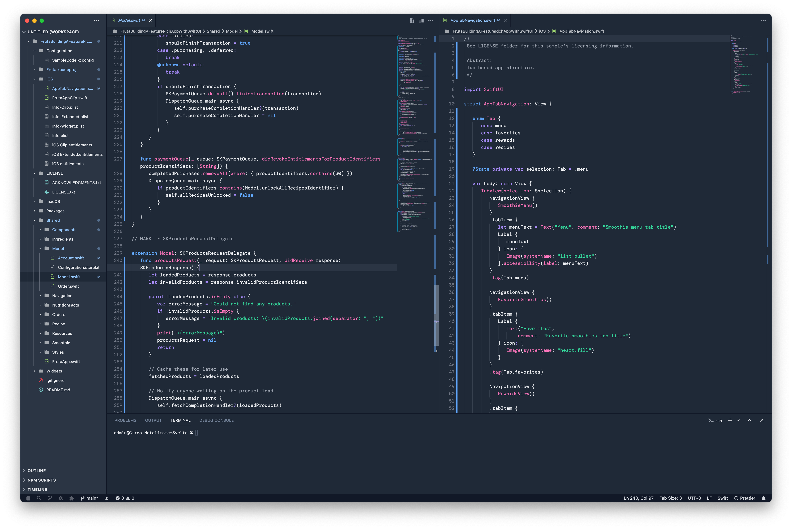
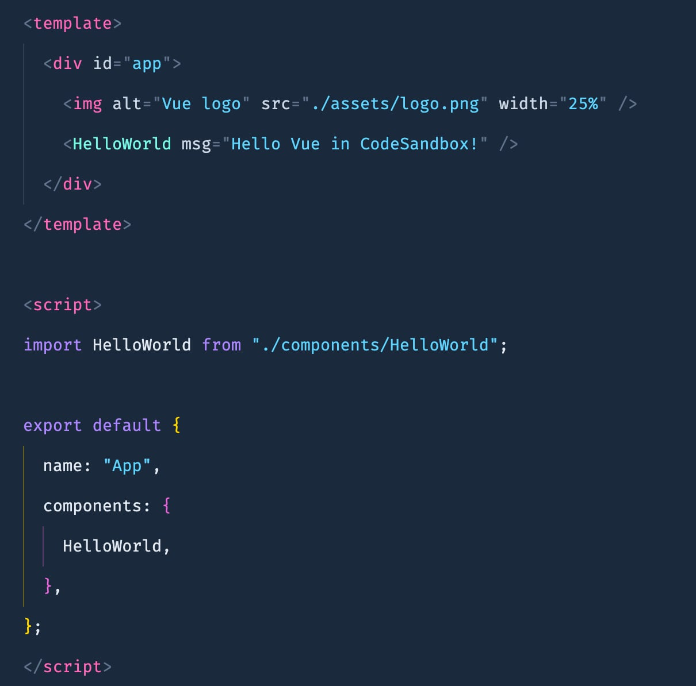

Lots of people (myself included) have been blown away by how good the syntax highlighting theme looks on the new [Tailwind CSS Docs Page](https://tailwindcss.com) - great job to all of the Tailwind Labs crew!

Until Tailwind Labs release an official theme ([fingers crossed it won't be too long!!](https://twitter.com/adamwathan/status/1469018263610875907)) - Here is a way to replicate the theme until the official one arrives!

  

**Step 1.** Install [Tailwind Moon theme](https://marketplace.visualstudio.com/items?itemName=shadowblood.tailwind-moon) by [Lucia Lovelace](https://github.com/luciascarlet)

**Step 2.** Set theme to _Tailwind Moon Blue_

** Step 3.** Open `Settings.json` and add some theme overrides

(To open Settings.json -> `Cmd/Ctrl` + `Shift` + `P` and search for `Settings` and choose `Preferences: open settings(JSON)`)

** Step 4.** Add the following to your settings.

(Note: this is setup for my preferences - but happy to [receive suggested improvements](https://gist.github.com/tailwindtoolbox/c70e3c0f6934e6cda3549151aeaf93f8))

  

## Examples

HTML

Vue

 
